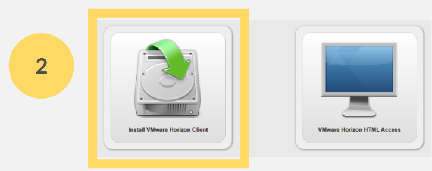

# MANUAL DE INSTALACIÓN DEL LABORATORIO VIRTUAL

 •	Ingresamos a <a href="url">https://labvirtual.up.edu.pe/</a>

•	Seleccionamos Install <b>VMware Horizon Client</b>

•	Veremos lo siguiente:

•	Bajamos y recorremos la página, hasta encontrar los productos. Escogemos el producto de acuerdo a nuestro sistema operativo.

•	Seleccionamos la versión más actual. Descargamos.

•	Ejecutamos el paquete descargado.

•	Damos click a <b>Agree & Install</b>

•	Esperamos a que termine de instalarse y damos click a <b>Finish</b>.

•	Reiniciamos nuestras terminales.

•	Buscamos entre nuestros programas a <b>VMware</b>.

•	Seleccionamos <b>Add Server</b>.

•	Nuestro servidor es <a href="url">https://labvirtual.up.edu.pe/</a>. Nos conectamos.

•	Ingresamos con nuestras cuentas educativas.

•	Escogemos cualquier de las instancias que nos hayan indicado.

•	Cuando ingresemos, vamos a la barra de VMware para poder minimizar la máquina virtual y ver nuestro desktop. Así podemos alternar entre la máquina virtual y nuestro desktop.

•	En la parte izquierda de la barra se puede fijar o desfijar la barra, de modo que no interrumpa la navegación.

•	No olvides que al igual que en la Sala de Computadoras de la UP, ningún archivo quedará guardado. Para salir debes cerrar sesión.

•	La próxima vez que ingresemos veremos que se ha quedado grabada nuestra conexión al servidor del laboratorio virtual.
Solo tenemos que seleccionarlo.

•	Luego, el procedimiento es el mismo que la primera vez. Primero, iniciamos sesión con nuestra cuenta educativa. Segundo, escogemos la instancia del laboratorio virtual.
¡Listo! Hemos terminado.

## Herramientas Tecnlógicas
I.   Laboratorio Virtual
## Contenido:

## Herramientas Tecnlógicas
<a href="https://fing-up.github.io/Ingenieria-de-datos/sql/LV.html">I.	Introducción a SQL</a>

<a href="https://fing-up.github.io/Ingenieria-de-datos/sql/DDL.html">II.	DDL: Data Definition Language</a>

<a href="https://fing-up.github.io/Ingenieria-de-datos/sql/DML.html">III.	DML: Data Manipulation Language</a>

<a href="https://fing-up.github.io/Ingenieria-de-datos/sql/CD.html">IV.	Consultas Condicionales</a>

<a href="https://fing-up.github.io/Ingenieria-de-datos/sql/CB.html">V.	Consultas Básicas</a>

<a href="https://fing-up.github.io/Ingenieria-de-datos/sql/CA.html">VII.	Consultas Agrupada</a>
